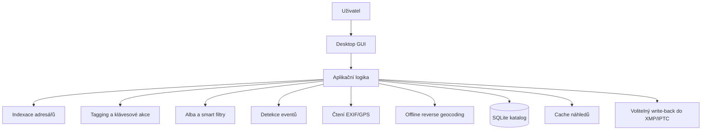

# Návrh offline aplikace pro třídění fotek pomocí tagů

Tento dokument popisuje návrh desktopové aplikace pro osobní offline správu fotek.

Hlavní cíle:

- rychlé třídění fotek přes klávesové zkratky
- možnost tagovat jednotlivé fotky i celé adresáře najednou
- využití metadat `datum pořízení` a `místo`
- práce bez cloudu a bez závislosti na Google Photos
- možnost později z tagged fotek skládat alba podle pravidel

## 1. Doporučený princip

Nejlepší varianta pro tento use-case není "správce souborů s přejmenováváním", ale:

- původní soubory nechat na disku tam, kde jsou
- nad nimi udržovat lokální katalog
- tagy, alba, hodnocení a poznámky ukládat primárně do lokální databáze
- metadata z fotek číst automaticky
- zápis do originálních souborů dělat jen volitelně

To je důležité, protože:

- je to bezpečnější pro originály
- je to rychlejší než neustále přepisovat EXIF/IPTC/XMP
- umožní to snadno dělat virtuální alba, chytré filtry a hromadné operace

## 2. Doporučená produktová podoba

Navrhuji desktopovou aplikaci se třemi hlavními režimy:

### A. Katalog

Slouží pro přidání kořenových složek s fotkami.

Funkce:

- přidat jeden nebo více zdrojových adresářů
- proindexovat obsah
- načíst metadata
- vytvořit náhledy
- zobrazit stav zpracování adresářů

### B. Třídění

Hlavní pracovní režim pro rychlé procházení a tagování.

Funkce:

- fullscreen nebo focused viewer
- velký náhled aktuální fotky
- pravý panel s tagy a metadaty
- spodní filmstrip nebo seznam miniatur
- rychlé přepínání mezi fotkami
- přidání/odebrání tagu jedním stiskem klávesy
- undo poslední akce

### C. Alba a filtry

Režim pro následnou práci s už otagovanými fotkami.

Funkce:

- statická alba
- smart alba podle pravidel
- filtrování podle tagů, data, místa, hodnocení, adresáře
- export výběru do nové složky, ZIPu nebo jen jako seznamu

## 3. Nejlepší workflow v praxi

Nejpraktičtější je rozdělit práci do dvou úrovní:

### Úroveň 1: Tagování adresářů nebo eventů

Použiješ ve chvíli, kdy celá složka patří k jedné akci.

Příklad:

- `2025-07-15 Dovolená Itálie`
- `2024-12-24 Vánoce`
- `2023-05-01 Výlet Beskydy`

Na této úrovni přidáš tagy jako:

- `dovolená`
- `rodina`
- `Itálie`
- `Vánoce`
- `hory`

Tyto tagy se budou dědit na všechny fotky v adresáři nebo eventu.

### Úroveň 2: Jemné tagování jednotlivých fotek

Použiješ pro detailní rozlišení uvnitř akce.

Příklad:

- `top`
- `tisk`
- `portrét`
- `děti`
- `jídlo`
- `mazat`
- `rozmazané`

Tím získáš dobrý poměr mezi rychlostí a přesností. Není efektivní tagovat každou fotku od nuly bez dědičnosti z adresáře.

## 4. Jak řešit klávesové zkratky

Klíčová je mapovat zkratky ne na akce aplikace, ale na konkrétní tagy.

Příklad profilu zkratek:

- `1` = `top`
- `2` = `rodina`
- `3` = `děti`
- `4` = `příroda`
- `5` = `jídlo`
- `6` = `výlet`
- `7` = `tisk`
- `8` = `archiv`
- `9` = `mazat`
- `0` = `rozmazané`

Doporučené ovládání:

- `Space` nebo `Right` = další fotka
- `Left` = předchozí fotka
- `1..0` = toggle tagu na aktuální fotce
- `Shift + 1..0` = odebrat tag
- `Ctrl + 1..0` = aplikovat tag na celý výběr
- `F` = označit jako oblíbené
- `X` = kandidát na smazání
- `U` = undo poslední tagovací operace
- `A` = přidat do alba
- `E` = otevřít editor všech tagů

Praktické doporučení:

- mít více sad zkratek
- jedna sada pro "rychlé třídění"
- druhá sada pro "tematické tagy"

## 5. Hromadné označování adresářů

Tohle je jedna z nejdůležitějších funkcí.

Aplikace by měla umět:

- označit celý adresář
- označit více adresářů najednou
- označit všechny fotky po filtrování
- uložit tag jako `folder tag`
- efektivně dopočítat, že fotka dědí tag z rodičovské složky

Doporučené chování:

- folder tag se fyzicky nekopíruje ke každé fotce
- aplikace počítá `efektivní tagy` jako:
  - přímé tagy fotky
  - tagy adresáře
  - případně tagy nadřazeného eventu

To je čistší a výrazně lépe se to spravuje.

## 6. Metadata: datum a místo

Metadata by měla být první vrstva automatické organizace.

### Datum pořízení

Použít v tomto pořadí:

1. `DateTimeOriginal` z EXIF
2. `CreateDate`
3. datum souboru jako fallback

Z data lze odvodit:

- rok
- měsíc
- den
- sezónu
- víkend / pracovní den
- čas dne
- automatické eventy podle časových mezer

### Místo

Použít v tomto pořadí:

1. GPS z EXIF
2. manuální tag adresáře nebo eventu
3. ruční doplnění uživatelem

Doporučené řešení je:

- uložit GPS souřadnice
- převést je offline na `země`, `region`, `město`, případně `lokalita`
- výsledek uložit do databáze

Pro offline reverse geocoding je vhodné:

- přibalit lokální databázi míst
- pro MVP stačí města, regiony a státy
- později lze rozšířit o detailnější dataset

Nejpraktičtější je neřešit mapový svět do detailu hned na začátku. Pro první verzi stačí spolehlivě dostat:

- `country`
- `region`
- `city`

## 7. Automatické eventy

Velmi doporučuji zavést mezivrstvu `event`.

Event je logická skupina fotek, která vznikne automaticky podle:

- časové blízkosti
- podobného místa
- případně stejné nadřazené složky

Jednoduché pravidlo pro MVP:

- pokud je mezi dvěma fotkami mezera větší než 6 hodin, začíná nový event
- pokud se místo změní o více než definovaný práh, začíná nový event
- pokud uživatel event ručně sloučí nebo rozdělí, jeho rozhodnutí má přednost

Výhoda:

- snadno označíš "celou akci"
- později z eventů půjdou dělat alba
- folder struktura na disku nemusí být perfektní

## 8. Jak navrhuji ukládat data

### Primární perzistence

Použít lokální `SQLite` databázi.

Důvody:

- je rychlá
- je jednoduchá na distribuci
- nevyžaduje server
- umí fulltext, indexy i složitější filtrování

### Doporučené tabulky

- `sources`
  - registrované kořenové adresáře
- `folders`
  - indexované složky
- `assets`
  - jednotlivé fotky a videa
- `asset_metadata`
  - EXIF, datum, GPS, kamera, rozměry
- `events`
  - automatické nebo ručně upravené skupiny
- `tags`
  - slovník tagů
- `tag_shortcuts`
  - mapování kláves na tagy
- `asset_tags`
  - přímé tagy fotek
- `folder_tags`
  - tagy aplikované na složky
- `event_tags`
  - tagy aplikované na event
- `albums`
  - uživatelská alba
- `album_items`
  - statická alba
- `album_rules`
  - pravidla smart alb
- `thumbnails`
  - metadata o cache náhledů

### Co neukládat jako jediný zdroj pravdy

Nedoporučuji mít tagy pouze:

- v názvech souborů
- v adresářové struktuře
- jen v EXIF/XMP uvnitř originálů

To by tě časem zablokovalo.

## 9. Zápis tagů do souborů

Nejlepší kompromis je tento:

- primární zdroj pravdy je databáze aplikace
- volitelně umět exportovat tagy do `XMP sidecar`
- volitelně umět zapsat vybrané tagy do IPTC/XMP v souboru

Proč nepsat rovnou do originálů vždy:

- je to pomalejší
- můžeš poškodit některé formáty
- RAW soubory je lepší nechat co nejvíc beze změny
- sidecar je bezpečnější

Doporučení:

- JPEG/PNG/HEIC: volitelný write-back
- RAW: raději `XMP sidecar`

## 10. Návrh alb

Tady je největší hodnota celé aplikace.

Nedoporučuji pracovat hlavně s fyzickými kopiemi fotek do složek typu:

- `rodina`
- `dovolená`
- `nejlepší`

To vede k duplicitám a chaosu.

Místo toho doporučuji tři vrstvy:

### A. Statické album

Ruční výběr fotek.

Použití:

- "Top 50 za rok 2025"
- "Fotky do fotoknihy"
- "Poslat rodičům"

### B. Smart album

Album se plní samo podle pravidel.

Příklady:

- všechny fotky s tagem `rodina`
- všechny fotky s tagy `dovolená` + `top`
- všechny fotky z `Itálie` v roce `2025`
- všechny fotky s `rating >= 4` a bez tagu `mazat`

### C. Event album

Album postavené nad logickými akcemi.

Příklady:

- všechny eventy s tagem `hory`
- všechny eventy z města `Brno`
- všechny letní dovolené za poslední 3 roky

## 11. Jak definovat pravidla pro smart alba

Pravidla by měla jít skládat nad těmito dimenzemi:

- tagy
- datum
- místo
- rating
- flagy typu `favorite`, `reject`
- typ souboru
- složka
- event

Příklady pravidel:

- `tag contains rodina`
- `tag contains top`
- `not tag contains mazat`
- `date.year = 2025`
- `place.country = Italy`
- `place.city = Brno`
- `rating >= 4`

Doporučuji podporovat:

- `AND`
- `OR`
- `NOT`
- uložené presety filtrů

## 12. Jak s otagovanými fotkami dál pracovat

Nejlepší model je:

- originály držet v relativně stabilní struktuře
- běžnou práci dělat přes katalog, filtry a smart alba
- fyzický export dělat až na konci

### Doporučená fyzická struktura na disku

Například:

- `Foto\2023\2023-05-01 Beskydy`
- `Foto\2024\2024-12-24 Vánoce`
- `Foto\2025\2025-07-15 Itálie`

To stačí.

Tematické členění jako `rodina`, `děti`, `jídlo`, `na tisk` už nedělej přes složky, ale přes tagy a alba.

### Exportní režimy

Aplikace by měla umět:

- exportovat album do nové složky
- zachovat původní názvy
- nebo vytvořit nový naming podle data a pořadí
- filtrovat jen JPEGy nebo jen finální výběr
- případně vytvářet symlinky místo kopií

## 13. Doporučený technologický stack

Protože chceš desktop, offline a pohodlné ovládání, doporučuji:

### Varianta A: Python + PySide6

Tohle považuji za nejlepší variantu.

Výhody:

- dobré desktop UI
- rozumná práce s klávesnicí
- dobré tabulky, stromy, gridy, drag and drop
- snadnější distribuce na Windows
- dobré napojení na SQLite i image processing

Knihovny:

- `PySide6` pro UI
- `SQLite` pro katalog
- `Pillow` nebo `pyvips` pro náhledy
- `exifread` / `piexif` / `ExifTool` bridge pro metadata
- případně `rapidfuzz` pro hledání a tag suggestions

### Varianta B: Tauri + frontend

Taky dobrá, pokud chceš modernější UI.

Nevýhoda:

- vyšší implementační složitost
- větší režie na propojení desktop funkcí a lokálních souborů

Pro osobní utility projekt bych začal Pythonem.

## 14. Doporučená interní architektura

Rozdělení modulů:

- `catalog`
  - scan složek, detekce změn, import
- `metadata`
  - čtení EXIF, GPS, datum, kamera
- `geo`
  - offline převod GPS na místo
- `tagging`
  - přímé tagy, folder tagy, event tagy, zkratky
- `albums`
  - statická alba, smart alba, export
- `events`
  - seskupení fotek do akcí
- `viewer`
  - full preview, grid, keyboard workflow
- `storage`
  - SQLite, migrace, cache

## 15. Co bych udělal v MVP

První verze by měla být úzká, ale prakticky použitelná.

### MVP scope

- přidání kořenových složek
- indexace fotek
- načtení data a GPS
- generování miniatur
- fullscreen prohlížení
- tagy přes klávesové zkratky
- hromadné tagování výběru a adresářů
- filtrování podle tagů, roku a místa
- statická alba
- jednoduchá smart alba

### Až druhá fáze

- offline reverse geocoding do detailnějších lokalit
- write-back do XMP/IPTC
- detekce duplicit
- podobné fotky / stackování sérií
- pokročilé event merge/split
- export presets

## 16. Praktické doporučení k tagům

Nedoporučuji mít stovky plochých tagů bez struktury.

Lepší je lehká taxonomie:

- `tema:rodina`
- `tema:dovolena`
- `tema:prace`
- `obsah:dite`
- `obsah:jidlo`
- `obsah:pes`
- `kvalita:top`
- `kvalita:tisk`
- `stav:mazat`
- `misto:italie`
- `misto:brno`

Výhoda:

- lépe se filtruje
- méně chaosu
- jde nad tím stavět smart alba

## 17. Moje doporučení jako cílové řešení

Kdybych to měl navrhnout pro sebe, šel bych takto:

1. Desktop app v `Python + PySide6`
2. `SQLite` jako hlavní katalog
3. originály ponechat na disku, bez povinného importu do vlastní knihovny
4. tagy ukládat primárně do DB
5. adresářové a event tagy řešit jako dědičné vrstvy
6. z EXIF tahat datum a GPS automaticky
7. GPS převádět offline minimálně na stát, region a město
8. pracovat hlavně se smart alby, ne s duplikovanými složkami
9. zápis do XMP/IPTC nechat jako volitelnou synchronizaci

Tohle řešení je dost robustní na dlouhodobé používání, ale pořád rozumně jednoduché na implementaci.

## 18. Další logický krok

Pokud budeš chtít pokračovat implementací, doporučuji jít v tomto pořadí:

1. potvrdit stack `Python + PySide6`
2. navrhnout konkrétní datový model SQLite
3. navrhnout obrazovky `Katalog`, `Třídění`, `Alba`
4. udělat první funkční MVP s tagy přes klávesy a folder tagy

Na to už pak jde navázat konkrétní technickou architekturou, strukturou složek a prvním skeletonem aplikace.
