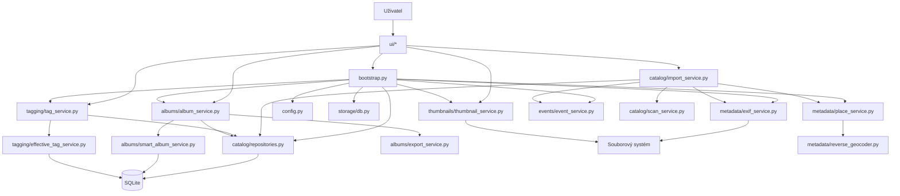
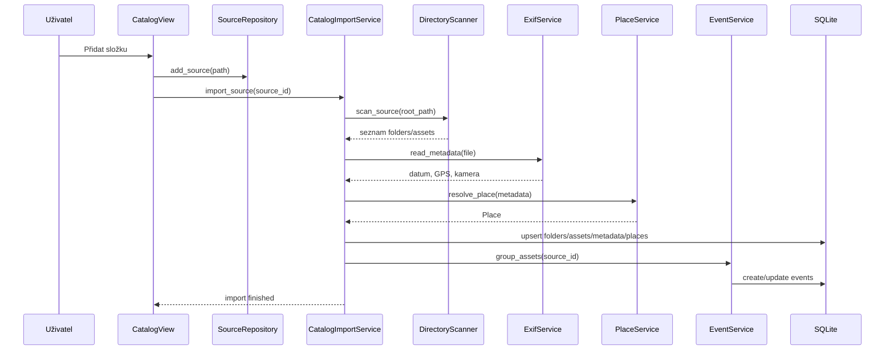
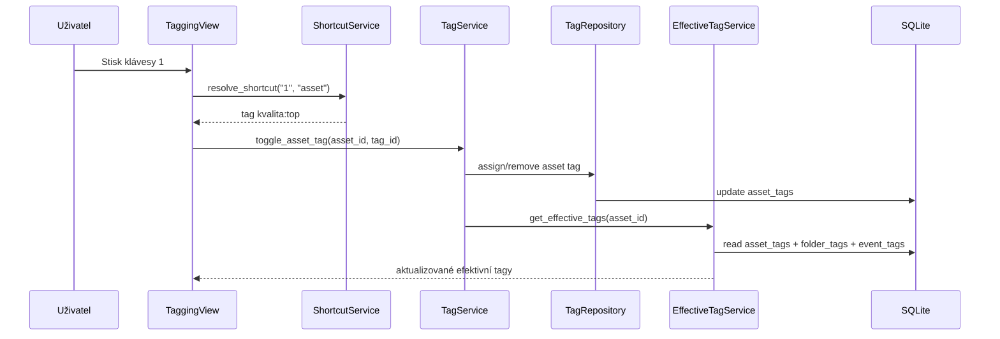
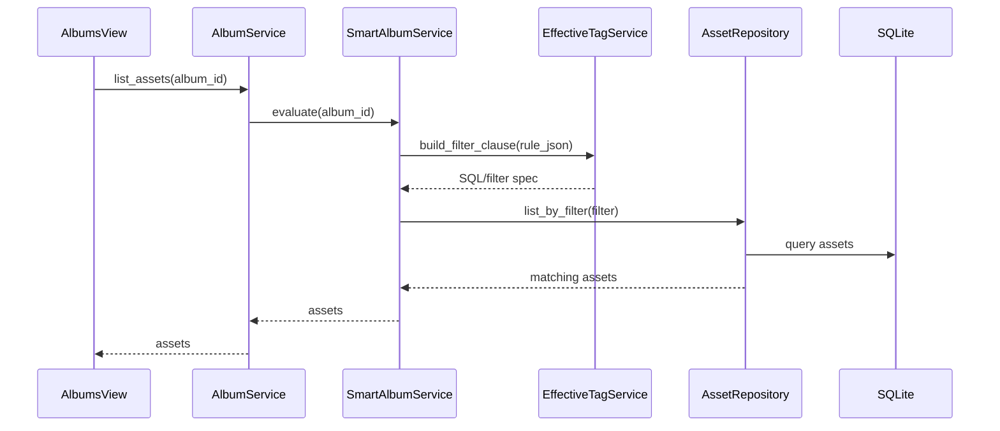
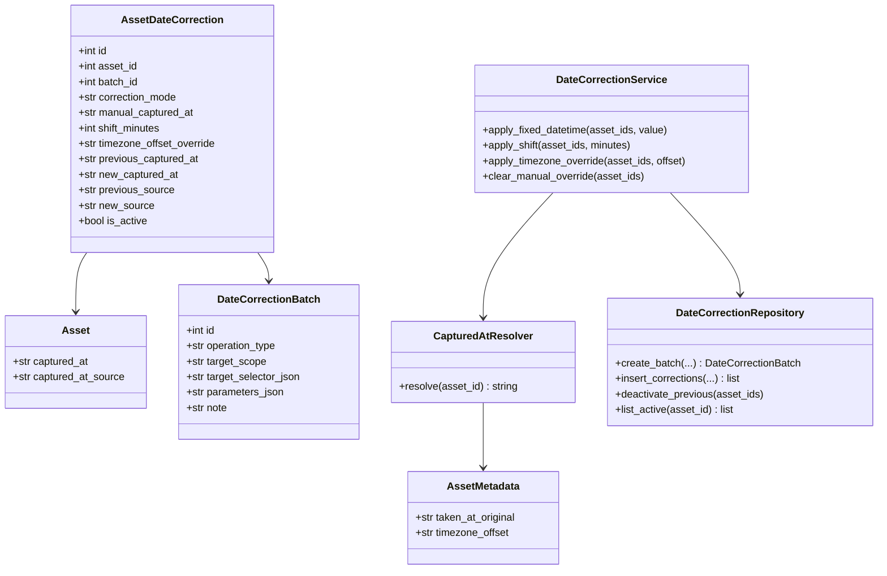
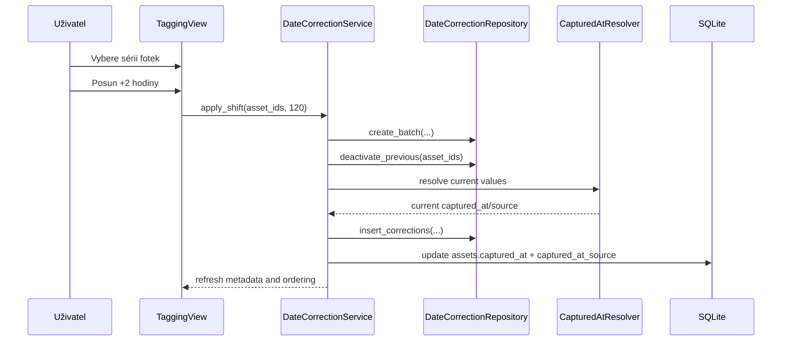

# Architektura modulů a tříd

Tento dokument převádí produktový návrh `Photos Tagger` do konkrétní technické architektury.

Cíl je mít jasně definované:

- moduly a jejich odpovědnosti
- klíčové třídy a jejich vazby
- datový tok od souborového systému po GUI
- hranici mezi aktuálním skeletonem a cílovou implementací

## 1. Architektonické principy

Aplikace stojí na těchto pravidlech:

- originální fotky zůstávají na disku, aplikace je nekopíruje do vlastní knihovny
- primární zdroj pravdy pro tagy, alba a katalog je `SQLite`
- metadata z fotek se čtou automaticky a ukládají se odděleně od uživatelských dat
- hromadné tagování funguje přes dědičnost z `folder` a `event`
- GUI je tenká vrstva nad aplikačními službami, ne místo pro obchodní logiku

## 2. Přehled modulů

Cílová struktura projektu:

```text
src/photos_tagger/
  main.py
  config.py
  bootstrap.py

  domain/
    models.py
    enums.py

  storage/
    db.py
    migrations.py
    unit_of_work.py

  catalog/
    repositories.py
    scan_service.py
    import_service.py
    change_detector.py

  metadata/
    exif_service.py
    place_service.py
    reverse_geocoder.py

  events/
    event_service.py

  tagging/
    tag_service.py
    shortcut_service.py
    effective_tag_service.py

  albums/
    album_service.py
    smart_album_service.py
    export_service.py

  thumbnails/
    thumbnail_service.py

  ui/
    main_window.py
    dialogs/
    views/
      catalog_view.py
      tagging_view.py
      albums_view.py
```

## 3. Odpovědnosti modulů

### `main.py`

Vstupní bod aplikace.

Odpovědnost:

- start aplikace
- vytvoření `QApplication`
- zavolání bootstrapu
- zobrazení hlavního okna

### `config.py`

Centrální správa cest a runtime adresářů.

Odpovědnost:

- zjistit root projektu
- určit `%LOCALAPPDATA%\PhotosTagger`
- vrátit cesty k DB, cache a logům

Aktuálně existuje v skeletonu.

### `bootstrap.py`

Kompoziční kořen aplikace.

Odpovědnost:

- vytvořit databázové připojení
- inicializovat repository vrstvy
- inicializovat služby
- injektovat závislosti do UI

Tento modul zatím v kódu není, ale je vhodné ho přidat, aby `main.py` nezarůstal ručním skládáním objektů.

### `domain/`

Čisté datové modely a enumy.

Odpovědnost:

- definovat `Source`, `Folder`, `Asset`, `AssetMetadata`, `Place`, `Event`, `Tag`, `Album`
- držet business význam objektů bez vazby na Qt nebo SQLite

Důvod:

- oddělení databázového řádku od doménového objektu
- snazší testování
- menší chaos v repository vrstvě

### `storage/`

Nízká vrstva persistence.

Odpovědnost:

- inicializace schema
- connection factory
- transakční obálka
- případně migrace

Aktuálně už existuje základ v `storage/db.py`.

### `catalog/`

Práce se zdrojovými složkami a katalogizací souborů.

Odpovědnost:

- ukládání a načítání `sources`, `folders`, `assets`
- scan disku
- detekce nových, změněných a smazaných souborů
- import do katalogu

### `metadata/`

Práce s EXIF a GPS.

Odpovědnost:

- načíst `DateTimeOriginal`, rozměry, orientaci, kameru
- načíst GPS souřadnice
- převést GPS na `Place`
- zapsat metadata do `asset_metadata` a `places`

### `events/`

Logické seskupování fotek do akcí.

Odpovědnost:

- vytvářet automatické eventy podle času a místa
- slučovat a dělit eventy
- respektovat ruční zamknutí eventu uživatelem

### `tagging/`

Tagovací logika.

Odpovědnost:

- CRUD nad tagy
- mapování kláves na tagy
- přiřazení tagu assetu, folderu nebo eventu
- výpočet efektivních tagů
- undo posledních tagovacích operací

### `albums/`

Statická a smart alba.

Odpovědnost:

- vytváření alb
- vkládání ručně vybraných fotek do statických alb
- ukládání a vyhodnocení smart pravidel
- export výsledného výběru

### `thumbnails/`

Cache náhledů.

Odpovědnost:

- generovat a ukládat miniatury
- vracet cestu k náhledu pro GUI
- invalidovat cache při změně souboru

### `ui/`

Qt vrstva.

Odpovědnost:

- zobrazit data z aplikačních služeb
- sbírat uživatelské akce
- předávat je do service vrstvy
- nezapisovat SQL a nečíst EXIF přímo z view

## 4. Modulový diagram



## 5. Konkrétní třídy

Níže je cílový návrh tříd. Část z nich už v projektu existuje, část je plánovaná pro další iterace.

### Runtime a bootstrap

- `AppPaths`
  - drží runtime cesty
- `ApplicationBootstrap`
  - skládá dohromady repository, služby a UI
- `DatabaseManager`
  - inicializuje schema a vrací připojení

### Domain model

- `Source`
- `Folder`
- `Asset`
- `AssetMetadata`
- `Place`
- `Event`
- `Tag`
- `TagShortcut`
- `Album`
- `AlbumRule`

### Repository vrstva

- `SourceRepository`
- `FolderRepository`
- `AssetRepository`
- `MetadataRepository`
- `TagRepository`
- `AlbumRepository`
- `EventRepository`

### Service vrstva

- `CatalogImportService`
- `DirectoryScanner`
- `ChangeDetector`
- `ExifService`
- `PlaceService`
- `OfflineReverseGeocoder`
- `EventService`
- `TagService`
- `ShortcutService`
- `EffectiveTagService`
- `AlbumService`
- `SmartAlbumService`
- `ExportService`
- `ThumbnailService`

### UI vrstva

- `MainWindow`
- `CatalogView`
- `TaggingView`
- `AlbumsView`
- později dialogy jako `FolderPickerDialog`, `TagEditorDialog`, `AlbumEditorDialog`

## 6. Diagram tříd

```mermaid
classDiagram
    class AppPaths {
        +string project_root
        +string user_data_dir
        +string db_path
        +string thumbnails_dir
        +string logs_dir
    }

    class ApplicationBootstrap {
        +build_paths() AppPaths
        +build_database() DatabaseManager
        +build_services() ServiceRegistry
        +build_main_window() MainWindow
    }

    class DatabaseManager {
        +initialize_schema()
        +get_connection() connection
    }

    class Source {
        +int id
        +str name
        +str root_path
        +bool is_active
    }

    class Folder {
        +int id
        +int source_id
        +int parent_id
        +str relative_path
        +str absolute_path
        +str folder_name
    }

    class Asset {
        +int id
        +int source_id
        +int folder_id
        +int event_id
        +str file_name
        +str absolute_path
        +str media_type
        +str captured_at
        +int rating
        +bool is_favorite
        +bool is_rejected
    }

    class AssetMetadata {
        +int asset_id
        +str taken_at_original
        +float gps_lat
        +float gps_lng
        +str camera_make
        +str camera_model
        +int place_id
    }

    class Place {
        +int id
        +str country_code
        +str country_name
        +str region_name
        +str city_name
        +float latitude
        +float longitude
    }

    class Event {
        +int id
        +int source_id
        +int folder_id
        +str title
        +str start_at
        +str end_at
        +str grouping_mode
        +bool user_locked
    }

    class Tag {
        +int id
        +str name
        +str slug
        +str category
        +str color
    }

    class TagShortcut {
        +int id
        +str key_sequence
        +int tag_id
        +str scope
    }

    class Album {
        +int id
        +str name
        +str album_type
        +str description
        +str sort_order
    }

    class AlbumRule {
        +int id
        +int album_id
        +str rule_json
        +bool is_enabled
    }

    class SourceRepository {
        +list_sources() list
        +add_source(path) Source
    }

    class FolderRepository {
        +upsert_folder(folder) Folder
        +list_by_source(source_id) list
    }

    class AssetRepository {
        +upsert_asset(asset) Asset
        +list_by_folder(folder_id) list
        +list_by_filter(filter) list
    }

    class MetadataRepository {
        +save_metadata(metadata) AssetMetadata
        +save_place(place) Place
    }

    class EventRepository {
        +create_event(event) Event
        +assign_asset(asset_id, event_id)
    }

    class TagRepository {
        +list_tags() list
        +assign_asset_tag(asset_id, tag_id)
        +assign_folder_tag(folder_id, tag_id)
        +assign_event_tag(event_id, tag_id)
    }

    class AlbumRepository {
        +create_album(album) Album
        +add_album_item(album_id, asset_id)
        +save_rule(rule) AlbumRule
    }

    class DirectoryScanner {
        +scan_source(root_path) ScanResult
    }

    class ChangeDetector {
        +diff(scan_result, catalog_state) CatalogDelta
    }

    class ExifService {
        +read_metadata(file_path) AssetMetadata
    }

    class OfflineReverseGeocoder {
        +resolve(lat, lng) Place
    }

    class PlaceService {
        +resolve_place(metadata) Place
    }

    class EventService {
        +group_assets(source_id)
        +split_event(event_id)
        +merge_events(event_ids)
    }

    class EffectiveTagService {
        +get_effective_tags(asset_id) list
        +build_filter_clause(filter) str
    }

    class ShortcutService {
        +resolve_shortcut(key_sequence, scope) TagShortcut
    }

    class TagService {
        +toggle_asset_tag(asset_id, tag_id)
        +assign_folder_tag(folder_id, tag_id)
        +assign_event_tag(event_id, tag_id)
        +undo_last_action()
    }

    class SmartAlbumService {
        +evaluate(album_id) list
        +preview(rule_json) list
    }

    class ExportService {
        +export_album(album_id, target_dir)
    }

    class AlbumService {
        +create_static_album(name) Album
        +create_smart_album(name, rule_json) Album
        +list_assets(album_id) list
    }

    class ThumbnailService {
        +ensure_thumbnail(asset_id) string
        +invalidate(asset_id)
    }

    class MainWindow {
        +show()
    }

    class CatalogView {
        +refresh_counts()
        +request_add_source()
        +request_scan()
    }

    class TaggingView {
        +show_asset(asset_id)
        +handle_shortcut(key_sequence)
    }

    class AlbumsView {
        +show_album(album_id)
        +create_album()
        +export_album()
    }

    ApplicationBootstrap --> AppPaths
    ApplicationBootstrap --> DatabaseManager
    ApplicationBootstrap --> SourceRepository
    ApplicationBootstrap --> FolderRepository
    ApplicationBootstrap --> AssetRepository
    ApplicationBootstrap --> MetadataRepository
    ApplicationBootstrap --> EventRepository
    ApplicationBootstrap --> TagRepository
    ApplicationBootstrap --> AlbumRepository
    ApplicationBootstrap --> DirectoryScanner
    ApplicationBootstrap --> ExifService
    ApplicationBootstrap --> PlaceService
    ApplicationBootstrap --> EventService
    ApplicationBootstrap --> TagService
    ApplicationBootstrap --> AlbumService
    ApplicationBootstrap --> ThumbnailService
    ApplicationBootstrap --> MainWindow

    DatabaseManager --> AppPaths

    SourceRepository --> DatabaseManager
    FolderRepository --> DatabaseManager
    AssetRepository --> DatabaseManager
    MetadataRepository --> DatabaseManager
    EventRepository --> DatabaseManager
    TagRepository --> DatabaseManager
    AlbumRepository --> DatabaseManager

    CatalogView --> SourceRepository
    CatalogView --> DirectoryScanner
    TaggingView --> TagService
    TaggingView --> ShortcutService
    TaggingView --> ThumbnailService
    TaggingView --> EffectiveTagService
    AlbumsView --> AlbumService
    AlbumsView --> SmartAlbumService
    AlbumsView --> ExportService

    TagService --> TagRepository
    TagService --> EffectiveTagService
    ShortcutService --> TagRepository
    PlaceService --> OfflineReverseGeocoder
    EventService --> EventRepository
    EventService --> AssetRepository
    AlbumService --> AlbumRepository
    AlbumService --> SmartAlbumService
    SmartAlbumService --> EffectiveTagService
    SmartAlbumService --> AssetRepository
    DirectoryScanner --> Source
    Asset --> Event
    AssetMetadata --> Place
    TagShortcut --> Tag
    AlbumRule --> Album
```



## 7. Datový tok při typických scénářích

### A. Přidání nové zdrojové složky



### B. Označení fotky tagem přes klávesu



### C. Vyhodnocení smart alba



## 8. Vazba na aktuální skeleton

Co už dnes v projektu existuje:

- `AppPaths` v `config.py`
- `DatabaseManager` v jednoduché podobě jako funkce v `storage/db.py`
- `MainWindow`
- `CatalogView`
- `TaggingView`
- `AlbumsView`
- SQL schema pro základní entity

Co je zatím jen návrh a mělo by přibýt:

- `bootstrap.py`
- doménové modely v `domain/`
- repository třídy místo přímého SQL z utility funkcí
- `CatalogImportService`
- `ExifService`
- `PlaceService`
- `EventService`
- `TagService`
- `ShortcutService`
- `EffectiveTagService`
- `AlbumService`
- `SmartAlbumService`
- `ThumbnailService`

## 9. Doporučené pořadí implementace

1. `bootstrap.py` a repository vrstva
2. `CatalogImportService` + `DirectoryScanner`
3. `ExifService` + zápis do `asset_metadata`
4. `TagService` + `ShortcutService`
5. `EffectiveTagService`
6. `ThumbnailService`
7. `AlbumService` + `SmartAlbumService`
8. `EventService`
9. export a volitelný write-back do XMP

## 10. Praktický závěr

Architektura je záměrně vrstvená:

- `UI` sbírá akce a zobrazuje výsledek
- `Services` drží obchodní logiku
- `Repositories` pracují s databází
- `Storage` řeší technické připojení a schema
- `Domain` drží čisté modely

To je důležité proto, aby se ti později nesmíchalo:

- Qt GUI
- SQL dotazy
- logika tagování
- EXIF parsing
- smart album pravidla

Pokud tuto hranici udržíš od začátku, aplikace půjde rozšiřovat bez přepisování celé struktury.


## 11. Ruční a hromadné opravy data pořízení

Pro datum pořízení je potřeba explicitně oddělit:

- původní datum z EXIF nebo jiného zdroje
- efektivní datum, které aplikace používá pro řazení a filtry
- audit ručních korekcí a batch operací

### Doporučené nové třídy

- `CapturedAtResolver`
  - spočítá efektivní datum z `asset_metadata`, fallbacků a aktivní korekce
- `DateCorrectionService`
  - aplikuje ruční a hromadné opravy data
- `DateCorrectionRepository`
  - zapisuje batch hlavičky a per-asset korekce
- `DateCorrectionBatch`
  - hlavička jedné operace
- `AssetDateCorrection`
  - detail jedné korekce na assetu

### Doporučené chování

- `asset_metadata.taken_at_original` zůstává nedotčené jako raw metadata
- `assets.captured_at` je efektivní datum pro GUI, filtry a smart alba
- `assets.captured_at_source` říká, odkud efektivní datum pochází
- `asset_date_corrections` drží audit a aktivní manuální zásahy

### Rozšíření modulů

Doporučené doplnění do struktury projektu:

```text
src/photos_tagger/
  metadata/
    exif_service.py
    place_service.py
    reverse_geocoder.py
    captured_at_resolver.py
    date_correction_service.py
```

### Diagram tříd pro datumové korekce



### Datový tok hromadné opravy



### Dopad do GUI

- `Katalog` musí umět batch opravu nad složkou nebo výsledkem filtru
- `Třídění` musí umět opravu nad aktuálním výběrem, eventem nebo sérií
- `Alba` a smart filtry musí vždy používat efektivní `assets.captured_at`, ne raw EXIF

### Praktický závěr

Bez této vrstvy se aplikace rychle dostane do slepé uličky, protože uživatel nebude mít jak bezpečně opravit špatně nastavené časy ve foťáku. Proto je správné držet:

- originální metadata odděleně
- efektivní datum v katalogu
- audit a batch model pro ruční opravy
